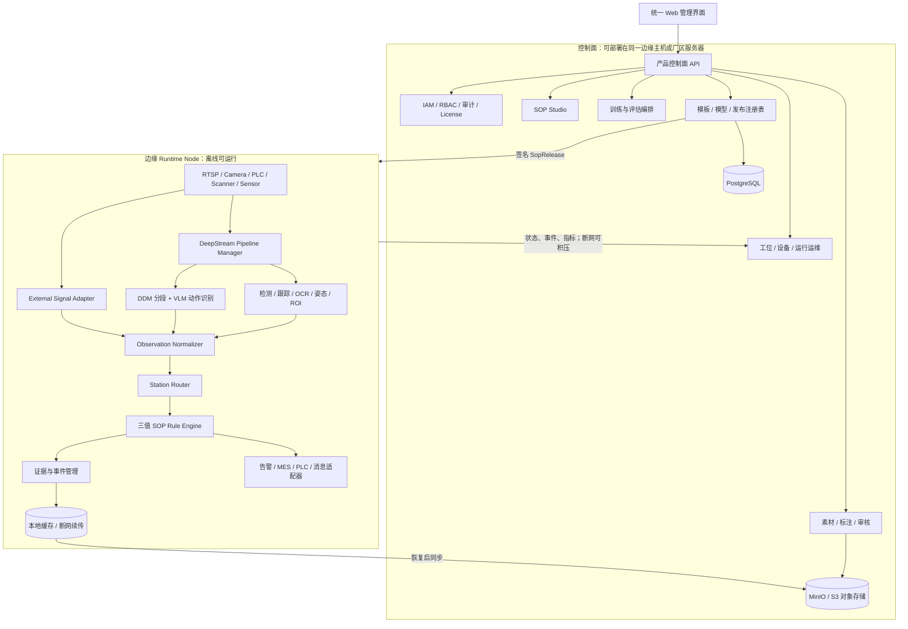

# NVIDIA SOP Monitoring Blueprint 商业化二次开发研究

日期：2026-08-26  
目标：基于 NVIDIA SOP Monitoring Blueprint，设计一套可在工厂内网部署、优先运行于 GeForce RTX 4090 的商业化 AI SOP 管理与实时监控软件。  
上游基线：[`NVIDIA/sop-monitoring-blueprints@6e149568`](https://github.com/NVIDIA/sop-monitoring-blueprints/tree/6e149568b52c92d06e5f72209f9b48df15b56c16)。本次拉取的 `main` HEAD 即该提交。

## 一、结论先行

1. **上游值得作为起点，但不是完整产品。** 它已经提供视频/RTSP/Basler 输入、DeepStream、DDM/GEBD 视频分段、Triton、Cosmos Reason VLM、SOP 漏步/乱序检查、时间段标注、QA 增强、VLM/DDM 训练与评估、FastAPI/SSE、Kafka、Prometheus，以及 VSS 示例部署资产。复用这些能力能显著缩短原型路径。
2. **上游核心语义仍是“动作编号序列”。** `actions.json` 只描述有序动作列表和可跳过动作；`SopChecker` 只从 VLM 文本提取动作编号并检查 missing/misordered。它不是支持检测、跟踪、OCR、姿态、ROI、计数、外部信号和三值语义的工业规则平台。
3. **产品核心不应是 VLM，而应是“带质量状态的观测契约 + 三值规则引擎”。** 只有当视频连续性、模型健康、时间同步和证据覆盖满足要求时，规则才允许输出“不通过”；断流、严重丢帧、模型超时或证据冲突必须输出“不可判定”。
4. **推荐双通道感知。** 检测/跟踪/OCR/姿态/ROI/计数/PLC 等承担高频、可解释的确定性观测；DDM+VLM 负责复杂动作片段识别和模板生成候选。二者都不能直接写最终违规结论。
5. **RTX 4090 适合开发、PoC 和受控试点。** 它有 24GB GDDR6X、Ada 架构、CUDA Capability 8.9，DeepStream 9.x 支持 Ada；2B VLM 单路推理、DDM、常规模型推理具备验证基础。但 NVIDIA 明确建议 24x7 dGPU 部署使用企业 GPU，并指出游戏 GPU并非为此环境设计。因此 4090 应列为“开发/试点认证档”，客户生产 SLA 需单独约定，长期建议提供 RTX PRO/企业 GPU 档。
6. **训练后置是正确取舍。** 上游 Cosmos-Reason 全量微调参考要求 `4 x A100 80GB`，不能原样迁移到单张 4090；DDM 默认支持单 GPU，目标检测等中小模型微调也更适合先在 4090 上完成。首版可先使用预训练模型、提示词、少量规则和人工校准，VLM 全量训练放到云端或客户训练集群。
7. **不建议先整体改写 Python/C++。** 上游重计算已由 DeepStream、Triton、TensorRT、PyTorch/vLLM 和 CUDA 执行。先固定上游提交、跑通 4090 基准，再只下沉被 profiling 证明的热路径。
8. **产品路线应先做窄场景闭环。** 首个可售试点只承诺 1 类 SOP、1-2 路视频、少量工位、有限规则原语、三值判定、证据和版本发布。一次性实现通用流程编排、全模型训练、多厂多租户和全工业协议，风险过大。

## 二、NVIDIA 上游已有能力

### 2.1 推理服务 `sop-inference-bp`

当前实现包括：

- 文件、RTSP、Basler 相机输入；
- DeepStream/PyServiceMaker 视频管线；
- `nvdspreprocess + nvinferserver/Triton` 执行 DDM/GEBD；
- 固定分段 `uniform` 或 DDM 动作边界分段；
- 从 GPU 视频帧构建 chunk，送入 vLLM 托管的 Cosmos Reason VLM；
- `actions.json + VLM 输出 -> SopChecker`；
- missing、misordered、cycle complete 和可跳过动作；
- OpenAI-compatible `/v1/chat/completions`、文件管理、健康检查、SSE；
- Prometheus 指标、可选 Kafka 消息、声音告警、视频 chunk 编码和 RTSP 输出；
- 可选 DDM TensorRT engine 构建和缓存，PyTorch 回退；
- 文件/RTSP/相机的延迟采集和 CSV 输出。

关键限制：

- `test_multiple_streams(..., concurrent=True)` 明确打印“not yet implemented”，然后顺序执行；上游没有可引用的并发多流结果。
- 上游 README 声称 low-latency/high-throughput，但仓库没有提交 GPU 型号、p95/p99、并发路数或稳定运行结果。
- `SopChecker` 只处理动作编号序列，不处理 ROI、目标 ID、姿态、OCR、计数、PLC、证据质量或不可判定。
- 默认部署仍要求用户提供 DDM 和 VLM checkpoint；README 建议针对客户 SOP 重新训练或微调。
- Docker 基线固定为 DeepStream 9.0 Triton，并叠加 VSS Engine、vLLM、PyTorch、Pylon、Kafka 等依赖，远非轻量边缘运行时。

### 2.2 训练服务 `sop-training-bp`

当前实现包括：

- React + FastAPI 的视频时间段标注 UI；
- 动作编号、描述、起止时间和并行动作标注；
- 按时间段切视频；
- BCQA、MCQA、GQA、DMCQA、DSQA、ENQA 等 QA 数据增强；
- Cosmos-Reason VLM 全量微调；
- DDM-Net 动作边界模型训练；
- 按动作评估和 DDM+VLM 端到端评估；
- Postgres 元数据和本地文件存储；
- 训练与评估微服务 API。

关键限制：

- 标注是**时间段动作标注**，不是目标框、实例分割、轨迹、关键点、OCR 区域或 ROI 标定工具。
- 没有 SOP 文档导入、文档步骤解析、文档与多段视频自动对齐、通用模板编辑器。
- 官方前置条件明确给出 Cosmos-Reason 全量微调参考硬件为 `4 x A100 80GB`。
- DDM 默认配置支持 `num_gpus: 1`，比 VLM 全量微调更适合在 4090 上先验证。
- GQA 默认可调用 NVIDIA NIM；虽支持本地 LLM URL，但离线依赖、模型和完整打包仍需产品方补齐。
- 官方安全说明明确：无 AuthN/AuthZ、HTTP 明文、单租户、无安全审计、无请求大小/速率/并发限制，属于受信内网参考部署。

### 2.3 Agentic Skills 与 VSS 示例

上游还提供：

- 生成、定制、评估、部署 DeepStream SOP 微服务的 Agentic Skills；
- 训练数据增强、微调、评估、RCA 和编排技能；
- 基于 VSS 3.1 的参考部署资产，包含 VST 录像、Kafka、Elasticsearch、Kibana、Redis、Agent、报告、Grafana 等。

正确定位：

- Agentic Skills 是研发与交付自动化资产，不是运行时产品功能。
- VSS 示例可借鉴录像、检索、报告和运维，但服务数量多、资源重、部署复杂；不宜未经 4090 资源验证就整体并入首版边缘产品。

## 三、12 项需求差距矩阵

| # | 需求 | 上游现状 | 差距等级 | 二次开发建议 |
|---|---|---|---|---|
| 1 | SOP 文档 + 多段视频生成可编辑模板 | 有动作列表、时间段标注、DDM 分段、VLM；无文档导入和统一模板 | 大 | 新增文档解析、步骤候选生成、跨视频对齐、模板草稿、人工审核与编辑器 |
| 2 | 检测、跟踪、OCR、姿态、ROI、计数、顺序、时限、外部信号 | 上游主链只有 DDM+VLM；DeepStream SDK本身有 `nvinfer/nvtracker/nvdsanalytics` | 大 | 新增通用感知图和类型化能力原语；复用 DeepStream/TAO/TensorRT，不自研媒体底座 |
| 3 | 漏步、错步、反序、超时、区域违规 | 有 missing/misordered；其余无 | 中到大 | 用通用 SOP 状态机替代专用 `SopChecker`，引入时窗、前置条件、禁止条件和空间规则 |
| 4 | 通过/不通过/不可判定 | 无三值语义和证据覆盖 | 关键缺口 | 新增质量状态、证据充分性和三值规则代数；不满足有效性门槛时禁止 FAIL |
| 5 | 一画面多工位、多路并发 | API 可启动流；并发 benchmark 未实现；无逻辑工位模型 | 关键缺口 | 单次解码/推理后按工位 ROI 路由观测；每工位独立 SOP 实例；先做并发压力基准 |
| 6 | 标注、审核、训练、导入、测试闭环 | 有动作时间标注、VLM/DDM 训练和评估 | 中到大 | 扩展目标/轨迹/关键点/OCR 标注；新增审核流、模型导入、统一评测、模型注册表 |
| 7 | 模板/模型版本发布、更新、回滚、绑定 | 环境变量、文件路径、checkpoint；无发布域模型 | 关键缺口 | 新增不可变 `SopRelease`、模型制品、工位绑定、签名、灰度、原子切换和回滚 |
| 8 | 大屏、实时状态、证据、告警、统计、整改 | VSS 示例有录像/ES/Kibana/报告；推理服务有 Kafka/告警 | 大 | 统一 Web 产品；首版自有轻量事件/证据/整改闭环，VSS 能力按需接入 |
| 9 | 内网部署、Runtime 离线、本地/云建模可选 | 可容器化本地运行；构建、模型下载和 NIM 有外部依赖 | 中 | 离线 OCI 包、模型包、许可证包、升级包；Runtime 禁止自动下载；建模适配本地/云端 |
| 10 | MES、PLC、扫码枪、传感器、平台接入 | RTSP、Basler、Kafka；无工业连接器框架 | 大 | 建立连接器 SDK、外部信号时间对齐、幂等命令和适配器隔离 |
| 11 | 权限、审计、授权、升级、监控、诊断 | 官方明确未提供产品安全能力 | 关键缺口 | 新增 IAM/RBAC、审计、License、SBOM、签名升级、备份恢复、诊断包和 SLO |
| 12 | 优先复用 NVIDIA，不无依据重写 | 上游已有完整参考主链 | 可满足 | 固定上游提交；保留 Python/DeepStream/Triton/VLM/训练；按 profiling 局部优化 |

## 四、推荐二次开发架构

### 4.1 总体原则

- **控制面与运行面分离**：Web、模板、训练、发布可停止或升级；边缘 Runtime 仍能离线持续判定。
- **观测与判定分离**：模型只输出客观观测及其质量，规则引擎负责 SOP 语义。
- **编辑态与发布态分离**：Runtime 只加载不可变、签名、依赖完整的发布物。
- **实时链路保持短小**：帧和高频元数据不经过 Kafka/gRPC/数据库往返；进程内或本机有界队列完成关键判定。
- **先模块化单体，再按负载拆服务**：首版避免为每项能力建立微服务；训练任务和 Runtime 进程隔离即可。
- **VLM 可降级**：VLM 不可用时，确定性 CV 规则仍可运行；依赖 VLM 的步骤进入不可判定或降级策略。

### 4.2 部署视图



### 4.3 控制面模块

#### A. SOP Studio

负责：

- PDF/DOCX/图片 SOP 文档导入和 OCR；
- 从文档提取步骤、注意事项、工具、对象、时限和验收条件；
- 导入多段标准/错误作业视频；
- DDM 建议动作边界，VLM 建议步骤描述和文档步骤对齐；
- 人工编辑步骤、分支、可跳过条件、重复、并行和异常路径；
- 配置每步需要的观测、有效性阈值、证据和告警策略；
- 生成 `SopDraft`，经审核后构建 `SopRelease`。

AI 只生成**草稿与建议**。模板发布必须有人审、可追溯、可复现。

#### B. 数据与标注

保留上游时间段动作标注，新增：

- 目标框/类别/属性；
- 目标轨迹与遮挡；
- ROI 多边形和工位区域；
- 人体关键点或动作标签；
- OCR 文本区域和转写；
- 正样本、违规样本、不可判定样本；
- 双人/多人并行动作；
- 标注审核、返工、抽检和一致性指标。

不建议从零自研全部标注能力。可在统一 Web Shell、统一用户和统一任务状态下集成成熟标注组件；上游时间段标注 UI 保留为动作分段专用工具。

#### C. 训练与模型管理

训练适配器分三类：

1. 上游 VLM/DDM：复用 Cosmos-Reason、DDM、数据增强和评估。
2. 经典 CV：优先采用 NVIDIA TAO 或许可证清晰的成熟框架，导出 ONNX/TensorRT 后由 DeepStream 部署。
3. 外部模型：支持客户导入 ONNX、TensorRT engine 构建输入、标签、预后处理配置和校验样本。

模型必须经过：数据版本锁定 -> 训练 -> 离线评估 -> 目标硬件 engine 构建 -> 黄金视频回放 -> 工位试运行 -> 审批 -> 发布。

#### D. 发布与绑定

建议核心制品：

```text
SopRelease
  release_id / version / schema_version
  sop_graph
  rule_definitions
  evidence_policy
  station_layouts / ROI / calibration
  required_models[]
  model_preprocess / postprocess / labels
  prompts / thresholds
  connector_requirements
  runtime_compatibility
  hashes / signature / created_by / approved_by
```

生命周期：

```text
Draft -> In Review -> Approved -> Released -> Deployed -> Retired
```

工位同时保存：

- `desired_release`：控制面希望运行的版本；
- `reported_release`：Runtime 实际成功加载的版本；
- 加载、warm-up、首帧、首推理和回滚结果。

切换必须先旁路校验和 warm-up，再原子切换。显存不足时支持短暂停机 cold swap，不能假装零停顿。

### 4.4 边缘 Runtime 模块

#### A. Source Manager

统一管理 RTSP、ONVIF/平台转发流、Basler、文件回放和外部信号。输出源健康状态：

- connected / reconnecting / failed；
- 最新 PTS、时钟漂移；
- 帧率、丢帧、乱序、卡顿；
- 解码错误和恢复次数。

#### B. DeepStream Pipeline Manager

从上游演进，保留 PyServiceMaker、DeepStream、Triton 和 TensorRT：

- 每个物理视频只解码一次；
- `nvstreammux` 负责多流批处理；
- `nvinfer` 承载检测、分类、OCR、姿态模型；
- `nvtracker` 产生稳定目标 ID；
- `nvdsanalytics` 提供 ROI、方向、越线、区域计数等基础元数据；
- DDM/VLM 作为可选语义分支；
- 高负载下按策略抽帧，预览支路不得反压判定支路。

#### C. Observation Normalizer

所有感知结果转换为统一观测：

```text
Observation
  observation_id
  source_id / station_id
  event_time / ingest_time
  type: object | track | text | pose | region | count | action | signal
  payload
  confidence
  validity: valid | degraded | gap | stale | conflict
  quality: frame_coverage / blur / occlusion / track_age / sync_error
  model_id / model_version / release_generation
  frame_ref / clip_ref
```

`Observation` 不允许包含 PASS/FAIL。

#### D. Station Router

一个画面可配置多个工位 ROI：

- 共享解码和基础推理；
- 按目标中心、底边点、mask 覆盖率或人员绑定规则把观测分发到工位；
- 每个工位维护独立 `SopInstance`；
- ROI 重叠、目标跨区、身份不清时标记 `conflict/degraded`，不能武断归属；
- 工位布局属于版本化发布物，而非运行时临时配置。

#### E. 三值 SOP Rule Engine

结果固定为：

- `PASS`：规则已满足，且证据有效；
- `FAIL`：违规谓词成立，且观测覆盖、时间同步、模型健康和证据充分性均达标；
- `INDETERMINATE`：证据不足、流中断、严重丢帧、模型超时、冲突、遮挡或配置不兼容。

典型规则：

- **漏步**：只有步骤时限结束、期间连续有效覆盖率达到阈值、且目标步骤未出现，才可 FAIL；若窗口内发生断流，则 INDETERMINATE。
- **错步**：识别到明确禁止动作，且动作置信度/持续时间/证据达到阈值，才可 FAIL。
- **反序**：后置步骤已有效完成，而必需前置步骤尚未完成，并且前置步骤观察窗口有效，才可 FAIL。
- **超时**：开始事件和结束事件均可信、时间源同步正常，持续时间超过阈值，才可 FAIL。
- **区域违规**：有效 track 在禁区持续超过 dwell time，且 ROI 版本、目标类别和 track 连续性均有效，才可 FAIL。

必须实现的安全不变量：

```text
if evidence_coverage < policy.minimum
   or stream_health is not healthy
   or inference_health is not healthy
   or timestamp_sync is invalid:
    decision != FAIL
```

#### F. 证据与响应

每个决定保存：

- 规则和模板版本；
- 模型版本；
- 原始时间戳；
- 前后文视频片段、关键帧、框/ROI/关键点叠加；
- 观测质量和覆盖率；
- 判定原因码；
- 操作者复核、申诉、整改、关闭记录。

告警渠道通过适配器执行：本机语音/声光、企业消息、邮件、Webhook、MES、PLC。响应失败不得改变已经发生的判定事实。

## 五、4090 部署与训练策略

### 5.1 先固定上游，再升级 DeepStream

上游提交使用 `nvcr.io/nvidia/deepstream:9.0-triton-multiarch`。最短路径是：

1. 先在 RTX 4090 上原样复现固定提交；
2. 建立功能、延迟、显存和稳定性基线；
3. 再单独迁移 DeepStream 9.1；
4. 迁移后重跑模型加载、TRT engine、断流、多流和 72h 门禁。

不要一开始同时升级 DeepStream、替换 VLM、重构服务和新增产品功能，否则无法定位问题来源。

### 5.2 推荐硬件档位

| 档位 | 建议 | 用途 |
|---|---|---|
| 开发/PoC | RTX 4090 24GB、64-128GB RAM、2TB NVMe、Ubuntu 24.04 | 单路/少量流、模型和规则验证 |
| 受控试点 | RTX 4090 24GB，工业机箱、足够散热、电源和 UPS | 客户接受游戏卡风险、无严格 24x7 硬件 SLA 的试点 |
| 生产 | RTX PRO/企业 GPU，按显存和路数选型 | 7x24、远程运维、较强硬件生命周期和支持要求 |

RTX 4090 官方规格：24GB GDDR6X、Ada、CUDA Capability 8.9、450W TGP；整机电源和散热不能按普通办公 PC 设计。

### 5.3 4090 上的推理取舍

建议首版配置：

- Cosmos-Reason2-2B；
- 单路或极少路 VLM chunk 推理；
- 降低 `VLM_FPS`、`VLM_MAX_FRAMES`、上下文长度和 `VLLM_MAX_NUM_SEQS`；
- 显式限制 vLLM GPU memory utilization，给 DDM、DeepStream decode surface 和经典 CV 模型预留显存；
- 先用 FP16/BF16，量化只有在模型兼容性和精度回归通过后启用；
- VLM 采用事件触发或低频语义检查，不对每帧运行；
- 经典 CV 负责需要低延迟和多路扩展的规则。

`VLLM_MAX_NUM_SEQS=16` 只是调度参数，不代表可稳定支持 16 路视频。

### 5.4 训练后置策略

| 训练类型 | 4090 建议 | 首版策略 |
|---|---|---|
| DDM 动作边界 | 可先尝试单 GPU、小 batch、AMP | P1/P2 可做 |
| 目标检测/分类 | 通常可在 24GB 上微调，视模型与分辨率 | P2 做 |
| OCR/姿态 | 选轻量模型，可本地微调或直接导入 | P2/P3 做 |
| Cosmos 2B 全量微调 | 上游参考是 4 x A100 80GB，单 4090 不按原方案承诺 | 后置到云端/客户集群 |
| VLM LoRA/QLoRA | 可能降低资源，但不是当前上游标准路径 | 单独 PoC 后决定，不能提前承诺 |

同一张 4090 上，训练和生产 Runtime 首版应**时间互斥**。容器和显存参数不能提供硬 GPU 隔离；维护窗口训练最可靠。

## 六、分阶段路线

以下周期是假设 6-8 人团队、已有工业视觉和前后端能力的粗估，不是固定交付承诺。

### P0：上游复现与 4090 证伪，3-4 周

目标：证明“值得二次开发”，而非开始堆产品页面。

交付：

- 固定上游提交和容器 digest；
- RTX 4090 上跑通文件、RTSP、DDM、2B VLM、checker；
- 单路 2 秒/5 秒 chunk 的 p50/p95/p99；
- 持续观察 chunk delay 是否累积；
- DDM-only、VLM-only、完整链路的显存/CPU/RSS；
- 断流、重连、模型超时、GPU OOM 故障注入；
- 2 路和 4 路真实并发测试工具；
- 72 小时稳定性；
- 许可证、checkpoint、容器和依赖 SBOM 初稿。

退出门禁：若单路 VLM 持续 backlog，则立即把 VLM 定位为低频/旁路能力，不再把它作为全部实时步骤的唯一识别器。

### P1：可售试点 Runtime，8-10 周

范围必须收窄：一个行业场景、一套 SOP、1-2 路视频、1-4 个逻辑工位。

交付：

- `Observation`、质量状态和三值判定；
- SOP 状态机：顺序、可跳过、重复、时限；
- 断流/丢帧/模型异常 -> INDETERMINATE；
- 一画面多工位；
- 证据帧和视频片段；
- 实时工位看板、当前步骤、告警和复核；
- 最小 `SopRelease`、工位绑定、原子加载和回滚；
- 本地离线运行、重启恢复、基础运行指标；
- 用户、角色和操作审计最小闭环。

P1 不做：通用训练平台、复杂流程图、所有工业协议、VSS 全栈和多租户 SaaS。

### P2：Authoring 与经典 CV 能力，10-12 周

交付：

- SOP 文档导入与步骤候选；
- 多视频 DDM 分段、VLM 对齐、模板草稿；
- 模板编辑、审核、发布；
- ROI 编辑器；
- 检测、跟踪、区域、计数能力；
- OCR/姿态各选一个真实客户场景落地；
- 扩展标注和审核；
- 模型导入、目标硬件 TensorRT 构建、黄金视频测试；
- 统计报表和整改闭环。

### P3：训练闭环、多流与工业集成，10-14 周

交付：

- DDM 和经典 CV 的训练/评估/注册；
- VLM 云端或客户集群训练适配；
- 多路视频调度、显存准入和负载保护；
- MES/PLC/扫码枪/传感器连接器 SDK；
- 外部信号时间对齐；
- Kafka/Webhook/OPC UA/Modbus 等按客户优先级逐个落地；
- 中央控制面 + 多边缘节点；
- 数据归档、备份恢复和跨节点运维。

### P4：商业化硬化，8-12 周并持续迭代

交付：

- 完整 RBAC/组织/站点模型；
- License、设备指纹、离线授权和续期；
- 镜像/模型/发布物签名；
- 离线安装、增量升级、回滚、兼容矩阵；
- CVE 扫描、SBOM、第三方 Notice；
- 诊断包、日志脱敏、远程运维授权；
- 7 天及更长 soak；
- 数据保留策略、隐私和客户安全基线；
- 生产 GPU 认证矩阵。

现实预期：窄场景可售试点约 4-5 个月；覆盖原始 12 项要求的商业 v1 通常需要 8-12 个月，并取决于客户场景数量和模型数据质量。

## 七、首个场景建议

首个场景应满足：

- 固定机位、光照可控；
- 1-2 人；
- 步骤清晰、周期 1-5 分钟；
- 工具/物料外观稳定；
- 违规可以通过顺序、区域、计数、时限表达；
- 不要求精细手指动作；
- 可采集足量正常、违规和不可判定视频。

建议首版只支持这些规则原语：

1. `ActionObserved`：VLM 或动作分类器识别动作；
2. `ObjectInRegion`：目标进入/停留 ROI；
3. `ObjectCount`：区域内数量；
4. `Sequence`：步骤前后关系；
5. `Deadline`：开始后必须在时限完成；
6. `ExternalSignal`：扫码/PLC/MES 事件；
7. `AllOf/AnyOf/Not`：有限组合；
8. `EvidenceRequired`：判定最低证据覆盖。

这足以覆盖多数装配、取放、扫码、点数和区域合规试点；暂不做任意脚本和无限自由流程图。

## 八、关键验收门禁

### 正确性

- 注入断流、严重丢帧、模型超时、时间戳跳变时，系统不得输出错误 FAIL；
- 每个 FAIL 必须可追溯到 release、模型、观测和证据；
- 模板切换期间旧事件不能污染新版本 SOP 实例；
- 多工位 ROI 重叠和人员跨区必须有确定的冲突策略。

### 性能

- 经典 CV 链路按 `source PTS -> decision` 报 p50/p95/p99；
- VLM 链路按 `chunk end -> result` 报 p50/p95/p99；
- 长流中 chunk delay 不持续增长；
- 多流报告吞吐、掉帧、公平性、显存峰值和恢复时间；
- 预览拥塞不得反压判定。

### 稳定性

- 先 72 小时，再 7 天；
- 记录 RSS、GPU memory、温度、功耗、队列、句柄、线程、磁盘和延迟趋势；
- 覆盖容器重启、宿主重启、磁盘不足、网络抖动、摄像头重启和坏模型包。

### 安全与交付

- Runtime 离线启动不得访问公网或自动下载；
- 所有管理 API 认证授权，关键操作审计；
- 模型、模板和升级包验签；
- 依赖、模型权重和数据许可证进入 SBOM/Notice；
- 备份和回滚在目标设备实测，而非只写文档。

## 九、主要风险与应对

| 风险 | 影响 | 应对 |
|---|---|---|
| VLM 延迟大或长流积压 | 无法实时、多流数骤降 | VLM 低频化；确定性 CV 快路径；P0 先证伪 |
| 客户现场遮挡、反光、机位变化 | 精度不可复现 | 现场拍摄规范、质量检测、不可判定、持续采样与校准 |
| 4090 24x7 可靠性 | SLA 和售后风险 | 明确硬件档位；工业机箱/UPS；生产推荐企业 GPU |
| 通用模板能力过度设计 | 工期失控 | 首版固定少量规则原语，从真实场景扩展 |
| 训练数据不足 | 模型无法达到验收 | 先规则/预训练；全量人工审核；按类统计数据缺口 |
| 模型/权重许可证不清 | 无法商业分发 | checkpoint 级许可证审核和 SBOM，不只看代码许可证 |
| 多工位归属错误 | 错判和证据混乱 | station router、track 连续性、冲突态和人工校准 |
| 上游升级破坏兼容 | 现场升级失败 | 固定提交/digest，兼容矩阵，旁路验证和回滚 |

## 十、建议立即执行的 4 周任务

1. 在独立仓库 vendor/fork 固定 `6e149568`，记录所有镜像 digest。
2. 在 RTX 4090 上跑通官方样例，不先改架构。
3. 补真正的 2 路/4 路并发 benchmark，拆分 DDM、VLM 和完整链路。
4. 用一个真实 SOP 采集：正常、漏步、反序、错步、超时、断流、遮挡七类视频。
5. 定义 `Observation`、`Decision`、`Evidence`、`SopRelease` 四个最小契约。
6. 先写三值规则引擎原型，证明断流不会误报 FAIL。
7. 只选一个检测模型和一个 ROI 规则接入 DeepStream，验证双通道架构。
8. 根据显存和延迟结果决定：2B VLM 常驻、按需加载，或独立第二张 GPU/第二节点。

P0 结束后再冻结产品 v1 范围。若 P0 未证明 VLM 实时性，不应继续以“VLM 覆盖所有步骤”为销售承诺。

## 十一、来源

### NVIDIA SOP Monitoring Blueprint

- [项目总览与端到端流程](https://github.com/NVIDIA/sop-monitoring-blueprints/blob/6e149568b52c92d06e5f72209f9b48df15b56c16/README.md)
- [推理服务 README](https://github.com/NVIDIA/sop-monitoring-blueprints/blob/6e149568b52c92d06e5f72209f9b48df15b56c16/microservices/sop-inference-bp/README.md)
- [推理 Docker 基线](https://github.com/NVIDIA/sop-monitoring-blueprints/blob/6e149568b52c92d06e5f72209f9b48df15b56c16/microservices/sop-inference-bp/docker/Docker.build)
- [推理 Compose 与 vLLM/显存配置](https://github.com/NVIDIA/sop-monitoring-blueprints/blob/6e149568b52c92d06e5f72209f9b48df15b56c16/microservices/sop-inference-bp/deploy/compose.yaml)
- [SOP Checker](https://github.com/NVIDIA/sop-monitoring-blueprints/blob/6e149568b52c92d06e5f72209f9b48df15b56c16/microservices/sop-inference-bp/nvds_action_detector/sop_step_checker.py)
- [性能测试说明](https://github.com/NVIDIA/sop-monitoring-blueprints/blob/6e149568b52c92d06e5f72209f9b48df15b56c16/microservices/sop-inference-bp/tests/README_perf.md)
- [多流测试当前顺序执行](https://github.com/NVIDIA/sop-monitoring-blueprints/blob/6e149568b52c92d06e5f72209f9b48df15b56c16/microservices/sop-inference-bp/tests/api_client_perf.py#L584)
- [训练服务 README、硬件要求与安全说明](https://github.com/NVIDIA/sop-monitoring-blueprints/blob/6e149568b52c92d06e5f72209f9b48df15b56c16/microservices/sop-training-bp/README.md)
- [动作时间段标注服务](https://github.com/NVIDIA/sop-monitoring-blueprints/blob/6e149568b52c92d06e5f72209f9b48df15b56c16/microservices/sop-training-bp/microservices/video-annotator-ms/README.md)
- [Cosmos 默认训练配置](https://github.com/NVIDIA/sop-monitoring-blueprints/blob/6e149568b52c92d06e5f72209f9b48df15b56c16/microservices/sop-training-bp/assets/config/train_config.toml)
- [DDM 单 GPU 默认训练配置](https://github.com/NVIDIA/sop-monitoring-blueprints/blob/6e149568b52c92d06e5f72209f9b48df15b56c16/microservices/sop-training-bp/assets/config/ddm_train_config.yaml)
- [第三方组件说明](https://github.com/NVIDIA/sop-monitoring-blueprints/blob/6e149568b52c92d06e5f72209f9b48df15b56c16/THIRD_PARTY_NOTICES.md)

### NVIDIA 与相关官方文档

- [DeepStream Overview](https://docs.nvidia.com/metropolis/deepstream/dev-guide/text/DS_Overview.html)
- [DeepStream 9.1 安装、平台矩阵与 24x7 GPU 建议](https://docs.nvidia.com/metropolis/deepstream/dev-guide/text/DS_Installation.html)
- [DeepStream `nvdsanalytics` ROI/越线/方向能力](https://docs.nvidia.com/metropolis/deepstream/dev-guide/text/DS_plugin_gst-nvdsanalytics.html)
- [DeepStream `nvtracker`](https://docs.nvidia.com/metropolis/deepstream/dev-guide/text/DS_plugin_gst-nvtracker.html)
- [DeepStream `nvinfer`](https://docs.nvidia.com/metropolis/deepstream/dev-guide/text/DS_plugin_gst-nvinfer.html)
- [NVIDIA TAO Model Zoo](https://docs.nvidia.com/tao/tao-toolkit/latest/text/model_zoo/overview.html)
- [TAO 与 DeepStream 集成](https://docs.nvidia.com/tao/tao-toolkit/latest/text/ds_tao/deepstream_tao_integration.html)
- [GeForce RTX 4090 官方规格](https://www.nvidia.com/en-us/geforce/graphics-cards/40-series/rtx-4090/)
- [vLLM GPU memory 与 serving 参数](https://docs.vllm.ai/en/stable/api/vllm/entrypoints/llm.html)

## 十二、研究限制

- 本报告未在 RTX 4090 上实际运行上游，因此所有路数、延迟、显存和准确率仍属于待 P0 验证项。
- DeepWiki MCP 尚未收录该 NVIDIA 仓库；本次改为直接拉取 GitHub 官方仓库固定提交并阅读源码，同时使用 NVIDIA/项目官方文档校验。
- 未完成具体模型权重、训练数据和 Basler Pylon 等商业条款的法律审查；Apache-2.0 仓库许可证不能自动覆盖所有下载权重、SDK 和数据。
